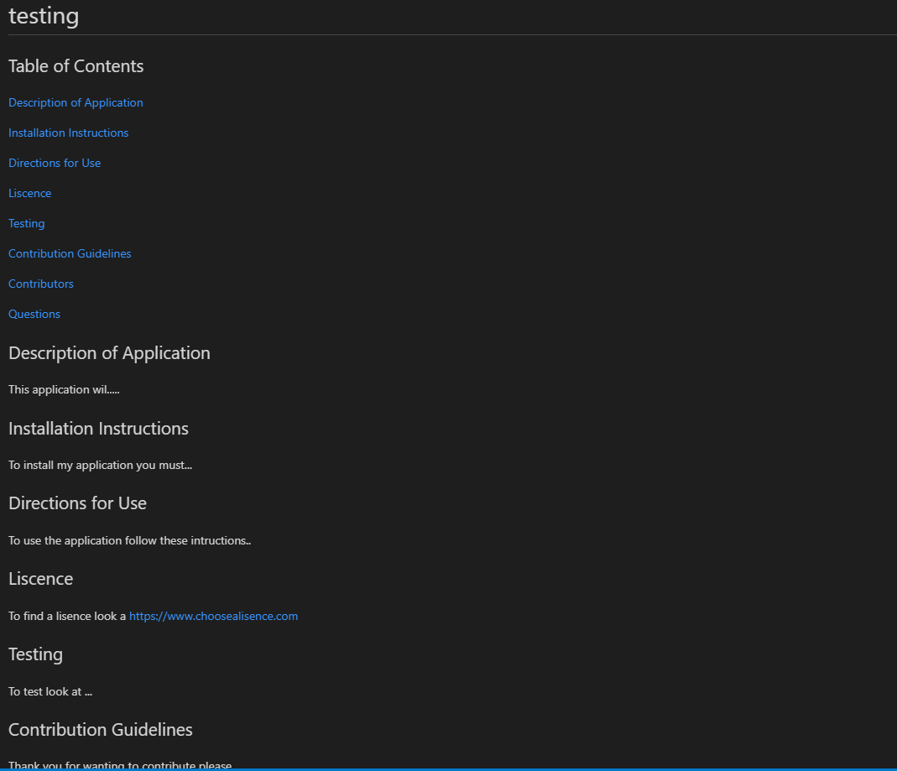

# Readme Generator
Below is an example of the output of the application, the file can be accessed [here](testing_README.md).




[Click here to view repository](https://github.com/anjkrish2608/readmeGenerator)

## Table of Contents

* [Description of Application](#des)
* [Technologies Used](#tech)
* [Challenges Faced](#chall)
* [Features to be Implemented](#dev)
* [Installation Steps](#insta)
* [How to Use](#use)
* [Credits](#cred)

<a id="des"></a>

## Description of Application
The Readme Generator is a CLI application which prompts the user for information which is then outputted in the form of a proffessional read me. The motivation behind the creation of this readme is to automate the process of creating a professional looking readme for a user's repository. An example output of this application is attached to the repository. Throughout the creation of this application I have learned the importance of attention to detail when it comes to syntax. I have also learned the new side of javascript *Node JS* which I have thoroughly enjoyed once I have understood the concepts.

<a id="tech"></a>

## Technologies Used
While creating this application I have used many different technologies listed below:

* JavaScript ES6 : to write all of the code inside index.js
* Node JS : to run the index.js file
* Inquirer Package : to ask the user for input
* Fs Package : to write the readme file

<a id="chall"></a>

## Challenges Faced
Throughout the creation of this application I have faced many challenges. In particular time management, I did not fully understand the concept until late resulting in the application to be created last minute. As a result not all of the suggested requirements have been met. However I can confidently say that I understand these technologies and syntax on a deeper level after completing this application and am excited to implement the extra suggestions later on.

<a id="dev"></a>

## Features to be Implemented
In the future I would like to implement the more sophisticated suggestion of the lisence from Trilogy education servies as shown below. 
```
WHEN I choose a license for my application from a list of options
THEN a badge for that license is added hear the top of the README and a notice is added to the section of the README entitled License that explains which license the application is covered under
```
Furthermore I would like to create a more detailed set of questions for each section in order to assure the user creates a high level of content inside the readme.


<a id="insta"></a>

## Installation Steps
1. Download Node.js
2. Download index.js to a folder.
3. Run the terminal in that folder and write the following commands:
```
npm init
npm install
npm install inquirer
```
4. Then run the index.js file using the command
```
node index.js
```

<a id="use"></a>

## How to Use
After following the Installation steps you will be prompted with a series of questions, answer accordingly and inside the folder there should be a new file named \"yourProjectTitle\_README.md\" which you can then upload to your application's repository.

<a id="cred"></a>

## Credits
As mentioned in [Technologies Used](#tech) the following assets were used:
* [JavaScript ES6](https://www.javascript.com/)
* [Node JS](https://nodejs.org/en/)
* [Inquirer Package](https://www.npmjs.com/package/inquirer)
* [Fs Package](https://www.npmjs.com/package/fs)
Furthermore for assistance when merging the two reponses the article [How to merge two objects in JavaScript](https://flaviocopes.com/how-to-merge-objects-javascript/) was consulted. Finally the requirements set for this application were supplied by Trilogy Education Services.

© 2019 Trilogy Education Services, a 2U, Inc. brand. All Rights Reserved.